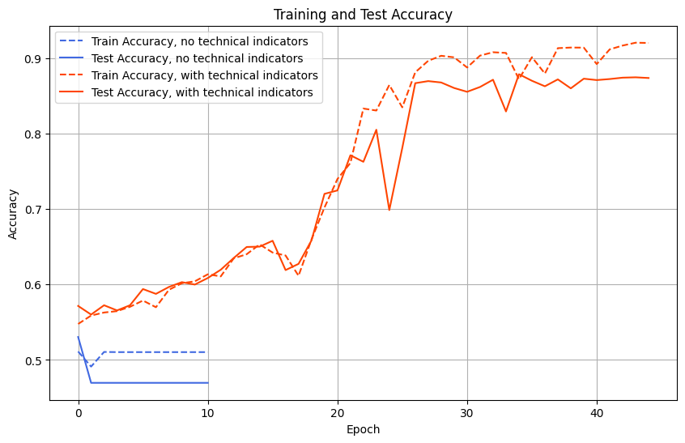

# Stock Price Movement Direction Prediction

## Project description

The aim of this project is to develop a model that can predict whether the price of a particular stock will be higher or lower in the next hour. The idea is not to find out what the price difference will be, just the direction of the price. This model will be a recurrent neural network, which, should be more efficient than a fully connected neural network.

## Dataset

The dataset consists of Apple OHLC data, retrieved using the Yahoo Finance API.

## Instructions to run

The whole code is inside the *src/notebook.ipynb* notebook. 

## Training and Testing Accuracy

